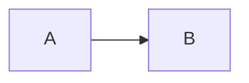
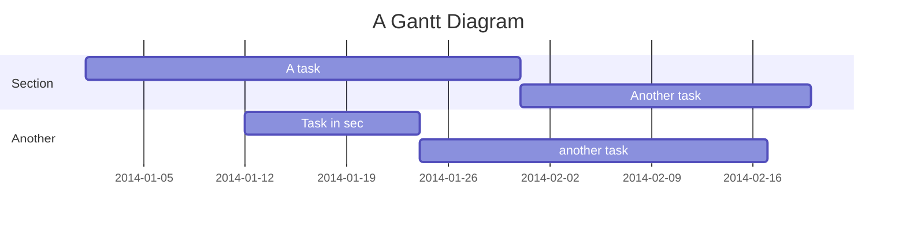

---
{"dg-publish":true,"dg-path":"09 Obsidian/专题文档/Digital Garden 文档/功能特性.md","permalink":"/09 Obsidian/专题文档/Digital Garden 文档/功能特性/","created":"2025-07-30","updated":"2025-07-30"}
---


您可以在您的数字花园的 [[@数字花园/09 Obsidian/专题文档/Digital Garden 文档/入门指南/03 笔记设置\|笔记设置]] 中启用以下功能：
- 局部关系图（Local Graph）
- 全局关系图（Global Graph）
- 反向链接（Backlinks）
- 目录（Table of Contents）
- 文件树导航（Filetree Navigation）
- 链接预览（Link Preview）
- 搜索（Search）
- Frontmatter 标签（Frontmatter Tags）

此外，数字花园还支持笔记中的多种格式和内容类型。

---

## Wikilinks

与在 Obsidian 中一样，使用 `[[Wikilink]]` 语法建立链接。

### 标题链接

链接到特定标题的方式与 Obsidian 相同：  
`[[我的笔记#笔记标题]]`

### 块链接

链接到特定块的方式与 Obsidian 相同：  
`[[我的笔记#^123abc]]`

### 自定义链接名称

更改 Wiki 链接的显示文本也与 Obsidian 相同。
`[[我的笔记|不同的笔记名称]]`

---

## 代码块


```javascript
let a = 5;
```


`some inline code`

---

## Dataview 查询

- [ ] 高级设置缺少部分文档 📅2025-07-30

```(dataview)
list from "高级设置"
```

- [[Advanced/Comparison to other solutions\|Comparison to other solutions]]
- [[@数字花园/09 Obsidian/专题文档/Digital Garden 文档/高级设置/添加自定义组件\|Adding custom components]]
- [[Advanced/Content Customization\|Content Customization]]
- [[Advanced/Configure build pipeline\|Configure build pipeline]]
- [[Advanced/Dataview queries\|Dataview queries]]
- [[Advanced/CSS Customization\|CSS Customization]]
- [[Advanced/Note Specific Settings\|Note Specific Settings]]
- [[Advanced/Hosting alternatives\|Hosting alternatives]]
- [[Advanced/Tips and Tricks\|Tips and Tricks]]
- [[Advanced/Fine grained access token\|Fine grained access token]]
- [[@数字花园/09 Obsidian/专题文档/Digital Garden 文档/高级设置/使用指南/添加评论\|Adding comments]]
- [[@数字花园/09 Obsidian/专题文档/Digital Garden 文档/高级设置/使用指南/添加统计\|Adding analytics]]
- [[Advanced/Roadmap\|Roadmap]]

{ .block-language-dataview}
More details about dataview is available here: [[Advanced/Dataview queries\|Dataview queries]]

---

## 标注

```
> [!NOTE] 笔记标题
> 笔记信息
```

> [!NOTE] 笔记标题
> 笔记信息

```
> [!WARNING] 警告标题
> 警告信息
```

> [!WARNING] 警告标题
> 警告信息

### 折叠标注

```
> [!NOTE]+ 默认展开
> 可展开/折叠的标注
```

> [!NOTE]+ 默认展开
> 可展开/折叠的标注

```
> [!FAQ]- 默认折叠
> 可展开/折叠的标注
```

> [!FAQ]- 默认折叠
> 可展开/折叠的标注

### 嵌套标注

```
> [!TIP] 嵌套标注
> 标注内的提示文本
> > [!EXAMPLE] 内部标注
> > 多个嵌套标注
> > > [!TODO] 内部的内部标注
```

> [!TIP] 嵌套标注
> 标注内的提示文本
>
> > [!EXAMPLE] 内部标注
> > 多个嵌套标注
> >
> > > [!TODO] 内部的内部标注

---

## MathJax / LaTex

[MathJax 参考](https://math.meta.stackexchange.com/questions/5020/mathjax-basic-tutorial-and-quick-reference)

```
$\frac{1}{0} = \infty$
```

$$\frac{1}{0} = \infty$$

---

## 标签

点击下面的标签可以查看具有相同标签的其他页面。

#示例标签

---

## ## 嵌入/包含的图像

``


## 嵌入文档

### 嵌入整个文件

`
<div class="transclusion internal-embed is-loaded"><a class="markdown-embed-link" href="/09 Obsidian/专题文档/Digital Garden 文档/示例页面/嵌入文档/" aria-label="Open link"><svg xmlns="http://www.w3.org/2000/svg" width="24" height="24" viewBox="0 0 24 24" fill="none" stroke="currentColor" stroke-width="2" stroke-linecap="round" stroke-linejoin="round" class="svg-icon lucide-link"><path d="M10 13a5 5 0 0 0 7.54.54l3-3a5 5 0 0 0-7.07-7.07l-1.72 1.71"></path><path d="M14 11a5 5 0 0 0-7.54-.54l-3 3a5 5 0 0 0 7.07 7.07l1.71-1.71"></path></svg></a><div class="markdown-embed">


这是一条被嵌入的笔记。

这是被嵌入笔记的一个块。 
### 这是一个标题

内容

#### 这是一个子标题

</div></div>
`


<div class="transclusion internal-embed is-loaded"><a class="markdown-embed-link" href="/09 Obsidian/专题文档/Digital Garden 文档/示例页面/嵌入文档/" aria-label="Open link"><svg xmlns="http://www.w3.org/2000/svg" width="24" height="24" viewBox="0 0 24 24" fill="none" stroke="currentColor" stroke-width="2" stroke-linecap="round" stroke-linejoin="round" class="svg-icon lucide-link"><path d="M10 13a5 5 0 0 0 7.54.54l3-3a5 5 0 0 0-7.07-7.07l-1.72 1.71"></path><path d="M14 11a5 5 0 0 0-7.54-.54l-3 3a5 5 0 0 0 7.07 7.07l1.71-1.71"></path></svg></a><div class="markdown-embed">


这是一条被嵌入的笔记。

这是被嵌入笔记的一个块。 
### 这是一个标题

内容

#### 这是一个子标题

</div></div>


### 嵌入标题块

`
<div class="transclusion internal-embed is-loaded"><a class="markdown-embed-link" href="/09 Obsidian/专题文档/Digital Garden 文档/示例页面/嵌入文档/#" aria-label="Open link"><svg xmlns="http://www.w3.org/2000/svg" width="24" height="24" viewBox="0 0 24 24" fill="none" stroke="currentColor" stroke-width="2" stroke-linecap="round" stroke-linejoin="round" class="svg-icon lucide-link"><path d="M10 13a5 5 0 0 0 7.54.54l3-3a5 5 0 0 0-7.07-7.07l-1.72 1.71"></path><path d="M14 11a5 5 0 0 0-7.54-.54l-3 3a5 5 0 0 0 7.07 7.07l1.71-1.71"></path></svg></a><div class="markdown-embed">


### 这是一个标题

内容

#### 这是一个子标题

</div></div>
`


<div class="transclusion internal-embed is-loaded"><a class="markdown-embed-link" href="/09 Obsidian/专题文档/Digital Garden 文档/示例页面/嵌入文档/#" aria-label="Open link"><svg xmlns="http://www.w3.org/2000/svg" width="24" height="24" viewBox="0 0 24 24" fill="none" stroke="currentColor" stroke-width="2" stroke-linecap="round" stroke-linejoin="round" class="svg-icon lucide-link"><path d="M10 13a5 5 0 0 0 7.54.54l3-3a5 5 0 0 0-7.07-7.07l-1.72 1.71"></path><path d="M14 11a5 5 0 0 0-7.54-.54l-3 3a5 5 0 0 0 7.07 7.07l1.71-1.71"></path></svg></a><div class="markdown-embed">


### 这是一个标题

内容

#### 这是一个子标题

</div></div>


### 嵌入块链接

`
<div class="transclusion internal-embed is-loaded"><a class="markdown-embed-link" href="/09 Obsidian/专题文档/Digital Garden 文档/示例页面/嵌入文档/#02502a" aria-label="Open link"><svg xmlns="http://www.w3.org/2000/svg" width="24" height="24" viewBox="0 0 24 24" fill="none" stroke="currentColor" stroke-width="2" stroke-linecap="round" stroke-linejoin="round" class="svg-icon lucide-link"><path d="M10 13a5 5 0 0 0 7.54.54l3-3a5 5 0 0 0-7.07-7.07l-1.72 1.71"></path><path d="M14 11a5 5 0 0 0-7.54-.54l-3 3a5 5 0 0 0 7.07 7.07l1.71-1.71"></path></svg></a><div class="markdown-embed">


这是被嵌入笔记的一个块。 

</div></div>
`


<div class="transclusion internal-embed is-loaded"><a class="markdown-embed-link" href="/09 Obsidian/专题文档/Digital Garden 文档/示例页面/嵌入文档/#02502a" aria-label="Open link"><svg xmlns="http://www.w3.org/2000/svg" width="24" height="24" viewBox="0 0 24 24" fill="none" stroke="currentColor" stroke-width="2" stroke-linecap="round" stroke-linejoin="round" class="svg-icon lucide-link"><path d="M10 13a5 5 0 0 0 7.54.54l3-3a5 5 0 0 0-7.07-7.07l-1.72 1.71"></path><path d="M14 11a5 5 0 0 0-7.54-.54l-3 3a5 5 0 0 0 7.07 7.07l1.71-1.71"></path></svg></a><div class="markdown-embed">


这是被嵌入笔记的一个块。 

</div></div>


值得注意的是，嵌入内容*不需要* `dg-publish` 属性。它们的表现与图片一样。只要你把某篇笔记发布出去，其中所有被嵌入的内容都会随该笔记一并发布，仿佛它们原本就是笔记的一部分。

（更多关于嵌入的详情见：[[高级设置/内容定制#嵌入\|内容定制#嵌入]]）
- [ ] 检查上面的嵌入，下面的部分也还都没翻译 📅2025-07-30
---

## Excalidraw


<style> .container {font-family: sans-serif; text-align: center;} .button-wrapper button {z-index: 1;height: 40px; width: 100px; margin: 10px;padding: 5px;} .excalidraw .App-menu_top .buttonList { display: flex;} .excalidraw-wrapper { height: 800px; margin: 50px; position: relative;} :root[dir="ltr"] .excalidraw .layer-ui__wrapper .zen-mode-transition.App-menu_bottom--transition-left {transform: none;} </style><script src="https://cdn.jsdelivr.net/npm/react@17/umd/react.production.min.js"></script><script src="https://cdn.jsdelivr.net/npm/react-dom@17/umd/react-dom.production.min.js"></script><script type="text/javascript" src="https://cdn.jsdelivr.net/npm/@excalidraw/excalidraw@0/dist/excalidraw.production.min.js"></script><div id="circleandsquareexcalidraw.md1"></div><script>(function(){const InitialData={"type":"excalidraw","version":2,"source":"https://excalidraw.com","elements":[{"id":"f8hC_7cbuAskISt7LXHyU","type":"freedraw","x":-195.4453125,"y":-145.6796875,"width":212.66796875,"height":190.98828125,"angle":0,"strokeColor":"#000000","backgroundColor":"transparent","fillStyle":"hachure","strokeWidth":1,"strokeStyle":"solid","roughness":1,"opacity":100,"groupIds":[],"strokeSharpness":"round","seed":30617569,"version":183,"versionNonce":654234753,"isDeleted":false,"boundElements":null,"updated":1668345152727,"link":null,"locked":false,"points":[[0,0],[0,0.15625],[0,1.23046875],[0,2.83984375],[0,4.28515625],[0,7.6953125],[0,9.6640625],[0,13.1640625],[0,17.015625],[0,22.5234375],[0,29.53515625],[0,37.2734375],[0,45.875],[0,55.23046875],[0,65.99609375],[0,78.390625],[0,101.140625],[0,109.53515625],[0,119.484375],[0.26171875,128.25],[0.7421875,133.80078125],[1.1875,137.5390625],[1.65625,141.57421875],[2.12109375,144.9609375],[2.5546875,148.0078125],[3.1328125,152.25],[3.31640625,153.8984375],[3.6484375,155.31640625],[3.82421875,156.66015625],[3.96484375,157.5859375],[4.08203125,158.16796875],[4.08203125,158.71875],[4.08203125,159.1015625],[4.11328125,159.359375],[4.2421875,159.62109375],[4.3359375,159.84375],[4.44140625,159.93359375],[4.61328125,159.93359375],[4.8828125,159.93359375],[5.4609375,159.93359375],[6.421875,159.93359375],[7.984375,159.93359375],[10.1875,159.8203125],[12.984375,159.48828125],[16.59765625,158.88671875],[22.21875,157.921875],[29.9140625,156.9140625],[38.36328125,156.171875],[47.16796875,155.75390625],[68.17578125,155.65234375],[81.4453125,155.65234375],[95.55859375,155.65234375],[110.7890625,155.9765625],[126.7265625,156.69921875],[142.23046875,157.48828125],[153.80078125,158.1875],[163.72265625,158.84765625],[175.1015625,159.22265625],[185.07421875,159.24609375],[193.45703125,159.24609375],[198.71875,159.24609375],[202.27734375,159.24609375],[205.98046875,159.24609375],[208.34375,159.24609375],[209.92578125,159.2578125],[211.07421875,159.4140625],[211.80078125,159.5546875],[212.19921875,159.5546875],[212.4375,159.5546875],[212.6640625,159.5546875],[212.66796875,159.5546875],[211.76953125,158.578125],[210.1796875,156.59375],[207.35546875,152.21875],[205.546875,149.546875],[202.64453125,144.99609375],[200.33203125,140.8984375],[198.26953125,136.55859375],[195.59375,130.42578125],[192.47265625,122.39453125],[189.80078125,114.02734375],[187.2890625,105.08984375],[184.60546875,94.85546875],[182.0390625,83.26171875],[179.8125,71.16796875],[177.67578125,59.07421875],[175.56640625,47.41796875],[174.1328125,38.36328125],[173.08203125,29.59765625],[172.06640625,19.2578125],[171.3984375,10.234375],[171.08203125,4.67578125],[170.80078125,0.07421875],[170.52734375,-5.10546875],[170.28515625,-9.5078125],[170.02734375,-18.03515625],[169.8125,-21.953125],[169.59375,-24.11328125],[169.40625,-25.7421875],[169.2421875,-27.31640625],[169.2109375,-28.46875],[169.05078125,-29.35546875],[168.88671875,-29.9375],[168.7421875,-30.359375],[168.6328125,-30.703125],[168.52734375,-30.80078125],[168.40625,-30.80078125],[168.390625,-30.8828125],[168.390625,-31.0078125],[168.28515625,-31.0546875],[168.09375,-31.0546875],[167.87109375,-31.0546875],[167.60546875,-30.98046875],[167.38671875,-30.8046875],[166.984375,-30.25],[166.359375,-29.48828125],[165.52734375,-28.68359375],[164.5078125,-27.82421875],[162.3125,-26.0546875],[160.44140625,-24.8671875],[158.2734375,-23.6875],[156.21875,-22.73046875],[153.6796875,-21.7421875],[150.5625,-20.6640625],[147.046875,-19.51953125],[143.34375,-18.28515625],[139.62109375,-16.890625],[135.90625,-15.59765625],[132.23828125,-14.44921875],[128.41015625,-13.296875],[124.33203125,-12.3203125],[120.2421875,-11.58984375],[115.99609375,-10.8671875],[107.15234375,-9.3984375],[102.68359375,-8.796875],[98.28515625,-8.1640625],[94.1484375,-7.453125],[90.08984375,-6.73046875],[85.7890625,-5.83984375],[81.57421875,-5.03125],[74.109375,-4.03515625],[70.66015625,-3.7890625],[67.15625,-3.74609375],[64.4453125,-3.74609375],[61.5,-3.74609375],[58.68359375,-3.74609375],[56.24609375,-3.74609375],[53.83203125,-3.74609375],[49.203125,-3.19140625],[47.06640625,-2.99609375],[44.90625,-2.8046875],[42.69140625,-2.62109375],[39.953125,-2.61328125],[37.28125,-2.41796875],[35.30859375,-2.21484375],[32.4453125,-1.9765625],[29.62890625,-1.75390625],[27.90625,-1.7265625],[25.74609375,-1.53125],[23.65625,-1.36328125],[21.8515625,-1.36328125],[20.2578125,-1.36328125],[18.875,-1.36328125],[17.546875,-1.36328125],[16.421875,-1.36328125],[15.5078125,-1.36328125],[14.78515625,-1.36328125],[14.1953125,-1.36328125],[13.61328125,-1.36328125],[13.08984375,-1.36328125],[12.71875,-1.36328125],[12.23828125,-1.36328125],[12.07421875,-1.36328125],[11.94921875,-1.36328125],[11.796875,-1.36328125],[11.6015625,-1.36328125],[11.3828125,-1.36328125],[10.91015625,-1.36328125],[10.7109375,-1.36328125],[10.44921875,-1.36328125],[10.2109375,-1.36328125],[10.2109375,-1.36328125]],"pressures":[],"simulatePressure":true,"lastCommittedPoint":[10.2109375,-1.36328125]},{"id":"_aZMwmY7FgcONG1cvm0G2","type":"freedraw","x":177.234375,"y":-154.55078125,"width":151.44921875,"height":185.6015625,"angle":0,"strokeColor":"#000000","backgroundColor":"transparent","fillStyle":"hachure","strokeWidth":1,"strokeStyle":"solid","roughness":1,"opacity":100,"groupIds":[],"strokeSharpness":"round","seed":1818718223,"version":131,"versionNonce":1618845231,"isDeleted":false,"boundElements":null,"updated":1668345154627,"link":null,"locked":false,"points":[[0,0],[0,-0.12890625],[-0.234375,-0.2578125],[-1.08984375,-0.2578125],[-2.02734375,-0.2578125],[-3.51171875,-0.2578125],[-5.16796875,-0.171875],[-9.39453125,0.88671875],[-12.9609375,1.93359375],[-18.1015625,3.53125],[-22.85546875,5.16015625],[-35.65234375,10.47265625],[-43.328125,14.3828125],[-50.73046875,18.80859375],[-57.0859375,23.06640625],[-62.66015625,27.09375],[-75.5859375,37.765625],[-80.89453125,42.44140625],[-85.57421875,47.23046875],[-89.71484375,51.6484375],[-93.0546875,55.68359375],[-96.1796875,60.4921875],[-99.2421875,65.9765625],[-101.7109375,71.29296875],[-103.875,76.91015625],[-105.79296875,83.08203125],[-108.41015625,96.8984375],[-109.28515625,104.05859375],[-109.5625,110.98046875],[-109.5625,117.20703125],[-109.5625,122.58203125],[-109.5625,127.80078125],[-109.5625,133.08984375],[-109.5625,138.33984375],[-109.42578125,143.50390625],[-108.41796875,148.5625],[-106.20703125,153.56640625],[-103.39453125,158.6015625],[-100.07421875,163.26953125],[-96.421875,167.4453125],[-92.84765625,171.375],[-89.19140625,174.78125],[-85.21484375,177.640625],[-81.1015625,179.8984375],[-77.09375,181.68359375],[-72.9296875,183.0625],[-68.34375,183.84765625],[-63.48046875,184.359375],[-58.8359375,184.859375],[-54.2578125,185.22265625],[-49.640625,185.34375],[-45.12109375,185.34375],[-40.46875,185.34375],[-35.8984375,185.34375],[-31.52734375,185.19140625],[-27.13671875,184.63671875],[-22.90234375,183.59375],[-14.7734375,180.3984375],[-10.9296875,178.55859375],[-7.11328125,176.46875],[-3.55859375,174.53515625],[-0.09765625,172.6875],[3.33984375,170.66796875],[6.59375,168.60546875],[9.9140625,166.45703125],[13.3203125,163.83203125],[16.64453125,161.21484375],[19.96484375,158.58984375],[22.265625,156.37109375],[25.1328125,153.0390625],[27.99609375,149.6796875],[29.47265625,147.5546875],[31.875,143.9453125],[34.18359375,140.421875],[35.4375,137.65625],[36.49609375,134.83984375],[37.52734375,131.98828125],[38.4140625,128.609375],[39.29296875,124.89453125],[39.94140625,121.18359375],[40.38671875,117.59765625],[40.8515625,113.796875],[41.3359375,109.65625],[41.73046875,105.63671875],[41.88671875,101.35546875],[41.88671875,96.5390625],[41.88671875,91.87890625],[41.88671875,87.44921875],[41.88671875,79.1328125],[41.7578125,75.58203125],[41.40625,71.80078125],[41.09375,68.8359375],[40.7734375,66.1875],[40.234375,63.2578125],[39.57421875,60.3203125],[38.78515625,57.24609375],[37.83203125,54.5703125],[36.69921875,52.15625],[35.625,49.87890625],[34.66015625,47.8984375],[33.55859375,45.828125],[31.24609375,41.71875],[30.26171875,39.83984375],[29.3125,38.1015625],[28.2265625,36.41015625],[27.1328125,34.9140625],[26.02734375,33.578125],[24.89453125,32.09765625],[23.78515625,30.78125],[22.7265625,29.70703125],[21.734375,28.8671875],[20.953125,28.2421875],[20.3515625,27.6484375],[19.765625,27.0625],[19.17578125,26.4609375],[18.57421875,25.69140625],[18.08984375,24.93359375],[17.453125,24.3203125],[16.703125,23.73046875],[15.3125,22.81640625],[14.5234375,22.375],[13.75,22.1015625],[13.02734375,21.94140625],[12.48828125,21.76171875],[12.0625,21.44140625],[11.6328125,20.96484375],[11.23046875,20.30859375],[10.921875,19.5390625],[10.6171875,18.765625],[10.6171875,18.765625]],"pressures":[],"simulatePressure":true,"lastCommittedPoint":[10.6171875,18.765625]}],"appState":{"theme":"light","viewBackgroundColor":"#ffffff","currentItemStrokeColor":"#000000","currentItemBackgroundColor":"transparent","currentItemFillStyle":"hachure","currentItemStrokeWidth":1,"currentItemStrokeStyle":"solid","currentItemRoughness":1,"currentItemOpacity":100,"currentItemFontFamily":1,"currentItemFontSize":20,"currentItemTextAlign":"left","currentItemStrokeSharpness":"sharp","currentItemStartArrowhead":null,"currentItemEndArrowhead":"arrow","currentItemLinearStrokeSharpness":"round","gridSize":null,"colorPalette":{}},"files":{}};InitialData.scrollToContent=true;App=()=>{const e=React.useRef(null),t=React.useRef(null),[n,i]=React.useState({width:void 0,height:void 0});return React.useEffect(()=>{i({width:t.current.getBoundingClientRect().width,height:t.current.getBoundingClientRect().height});const e=()=>{i({width:t.current.getBoundingClientRect().width,height:t.current.getBoundingClientRect().height})};return window.addEventListener("resize",e),()=>window.removeEventListener("resize",e)},[t]),React.createElement(React.Fragment,null,React.createElement("div",{className:"excalidraw-wrapper",ref:t},React.createElement(ExcalidrawLib.Excalidraw,{ref:e,width:n.width,height:n.height,initialData:InitialData,viewModeEnabled:!0,zenModeEnabled:!0,gridModeEnabled:!1})))},excalidrawWrapper=document.getElementById("circleandsquareexcalidraw.md1");ReactDOM.render(React.createElement(App),excalidrawWrapper);})();</script>

> [!info]
> Obsidian specific features like linking to other notes inside the drawings are currently not supported

---

## Mermaid diagrams







---

## PlantUML diagrams

```plantuml
@startuml
title Software System - Containers

left to right direction

skinparam {
  shadowing false
  arrowFontSize 10
  defaultTextAlignment center
  wrapWidth 200
  maxMessageSize 100
}

hide stereotype

skinparam rectangle<<SoftwareSystem.Database>> {
  BackgroundColor #438dd5
  FontColor #ffffff
  BorderColor #2e6295
  roundCorner 20
}
skinparam person<<User>> {
  BackgroundColor #08427b
  FontColor #ffffff
  BorderColor #052e56
}
skinparam rectangle<<SoftwareSystem.WebApplication>> {
  BackgroundColor #438dd5
  FontColor #ffffff
  BorderColor #2e6295
  roundCorner 20
}

person "==User\n<size:10>[Person]</size>" <<User>> as User

package "Software System\n[Software System]" <<SoftwareSystem>> {
  skinparam PackageBorderColor<<SoftwareSystem>> #444444
  skinparam PackageFontColor<<SoftwareSystem>> #444444

  rectangle "==Web Application\n<size:10>[Container]</size>" <<SoftwareSystem.WebApplication>> as SoftwareSystem.WebApplication
  rectangle "==Database\n<size:10>[Container]</size>" <<SoftwareSystem.Database>> as SoftwareSystem.Database
}

User .[#707070,thickness=2].> SoftwareSystem.WebApplication : "<color:#707070>Uses"
SoftwareSystem.WebApplication .[#707070,thickness=2].> SoftwareSystem.Database : "<color:#707070>Reads from and writes to"
@enduml
```



---

## Highlighted text


==Here is some highlighted text==

---

## Footnotes

```markdown
There is a footnote here [^1]
```

There is a footnote here [^1]

---

## Checkboxes

```markdown
- [ ] Uncheckd
- [x] Checked
```

- [ ] Uncheckd
- [x] Checked

---

## Sitemap

The site automatically generates a sitemap.xml file, available at `/sitemap.xml` on your site. This helps search engines properly index your site, making it more discoverable. For the sitemap to be properly formatted with the full URL for all your pages, the plugin needs to know the base URL of your site. By adding your URL to the plugin settings, the sitemap should automatically be generated using that value.


---

## Atom/RSS feed

The site automatically generates an Atom/RSS feed available at `/feed.xml` on your site. In order for this to be generated you need to add your Base URL in the settings, like in the image above. 
For the dates to work properly, you need to enable the [[@数字花园/09 Obsidian/专题文档/Digital Garden 文档/入门指南/04 外观设置#Timestamps Settings\|Show updated timestamp]] setting under the plugin's Appearance settings. If this is not enabled, the feed will use the last date the site was built, which in practice means the last date you last published anything to the site. 

---

## Footnote source

```markdown
[^1]: Here are some extra information in a footnote
```

[^1]: Here are some extra information in a footnote